# 🚀 Code Review Assistant

**AI-powered code reviews** with a Vite + React frontend and a Node/Express backend using **Google Gemini**.  
Upload a code file and instantly receive **concise, actionable feedback**.

---

✨ Features

- 📂 Upload code files and get instant AI-generated reviews.  
- ⚡ Concise bullet feedback: *Issues, Quick Fixes, Security, Performance, Improvements.*  
- 🧠 Local history dashboard (stored in browser `localStorage`).  
- 🔁 Seamless dev setup with Vite proxy to backend.  
- 🧩 Clean separation of concerns — **Controller → Service → Gemini Integration**.

---

🧱 Tech Stack

**Frontend:** React 18 · Vite · React Router · Axios · CSS  
**Backend:** Node.js · Express · Multer · dotenv · @google/generative-ai  
**Dev Tools:** nodemon (backend live reload)

---

📁 Project Structure


```
code-review-assistant/
├── backend/
│ ├── controllers/
│ │ └── reviewController.js
│ ├── services/
│ │ ├── reviewService.js
│ │ └── geminiService.js
│ ├── server.js
│ └── package.json
└── frontend/
├── src/
│ ├── components/
│ │ ├── UploadSection.jsx
│ │ ├── ReviewDisplay.jsx
│ │ └── Dashboard.jsx
│ ├── services/
│ │ └── api.js
│ ├── utils/
│ │ └── storage.js
│ ├── App.jsx
│ ├── App.css
│ └── main.jsx
├── vite.config.js
└── package.json

```
---
## 📊 Architecture Overview

```mermaid
graph LR
  %% Code Review Assistant - End-to-End (Improved)

  subgraph Frontend["Frontend (Vite + React)"]
    User["👤 User"]
    UI["UploadSection / Dashboard / ReviewDisplay"]
    APIc["API Client (Axios)"]
    LS["LocalStorage (review history)"]
    Router["React Router"]
  end

  subgraph Backend["Backend API (Node + Express)"]
    RT["Routes /api/*"]
    CTRL["Controllers (reviewController)"]
    MW["Middleware (Multer upload, CORS, error handler)"]
  end

  subgraph Services["App Services"]
    RSV["Review Service (prompt builder)"]
    GSV["@google/generative-ai Wrapper (Gemini Service)"]
  end

  subgraph External["External API"]
    GEM["Google Gemini Model (gemini-pro)"]
  end

  subgraph Storage["Client-Side Storage"]
    LSH["History Cache (localStorage)"]
  end

  %% Flow
  User -->|"selects code file"| UI
  UI -->|"POST /api/review/analyze (multipart)"| APIc
  APIc --> RT
  RT --> CTRL
  CTRL --> MW
  CTRL --> RSV
  RSV --> GSV
  GSV -->|"generateContent(prompt)"| GEM
  GEM -.->|"LLM Review Text"| GSV
  GSV -.-> RSV
  RSV -.-> CTRL
  CTRL -.->|"JSON {review, fileName, timestamp}"| APIc
  APIc -.-> UI
  UI -->|"save entry"| LS
  LS --> LSH
  UI -->|"GET history"| LSH
  Router --> UI

  %% Styling
  classDef client fill:#8b5cf6,stroke:#2b2b2b,color:#fff;
  classDef server fill:#06b6d4,stroke:#2b2b2b,color:#fff;
  classDef svc fill:#10b981,stroke:#2b2b2b,color:#fff;
  classDef ext fill:#f59e0b,stroke:#2b2b2b,color:#1f1f1f;
  classDef store fill:#1f2937,stroke:#2b2b2b,color:#e5e7eb;

  class User,UI,APIc,LS,Router client
  class RT,CTRL,MW server
  class RSV,GSV svc
  class GEM ext
  class LSH store
```




## 🪄 Prerequisites

- Node.js 18 or newer  
- A **Google Gemini API key** (obtainable from [Google AI Studio](https://makersuite.google.com/))

---

## ⚙ Quick Start

### 1️⃣ Clone Repository
bash
git clone https://github.com/<your-username>/<your-repo>.git
cd <your-repo>
`

### 2️⃣ Backend Setup

bash
cd backend
npm install


Create a `.env` file inside `backend/`:

bash
GEMINI_API_KEY=YOUR_GEMINI_API_KEY
PORT=5000
FRONTEND_URL=http://localhost:5173


Ensure `backend/package.json` includes:

json
"type": "module",
"scripts": {
  "start": "node server.js",
  "dev": "nodemon server.js"
}


Run backend:

bash
npm run dev


Health check:
👉 [http://localhost:5000/api/health](http://localhost:5000/api/health) → should return `{ "status": "OK" }`

---

### 3️⃣ Frontend Setup

bash
cd ../frontend
npm install


Ensure your `vite.config.js` includes a proxy:

js
server: {
  port: 5173,
  proxy: {
    '/api': {
      target: 'http://localhost:5000',
      changeOrigin: true
    }
  }
}


Run frontend:

bash
npm run dev


Visit the app 👉 [http://localhost:5173](http://localhost:5173)

---

## 🧭 Usage

1. Click **“Choose Code File”** and select a code file
   (`.js, .jsx, .ts, .tsx, .py, .java, .cpp, .c, .html, .css, .go, .rb, .php`)
2. Click **“Analyze Code”**
3. View concise AI-generated feedback
4. Reviews are saved automatically to `localStorage` and visible in the Dashboard

---


---

## ⚙ Environment Variables

**`backend/.env`**


GEMINI_API_KEY=YOUR_GEMINI_API_KEY
PORT=5000
FRONTEND_URL=http://localhost:5173


No frontend env needed — Vite proxy handles API routing.

---

## 🧩 NPM Scripts

**Backend**

bash
npm run dev     # Start API with nodemon
npm start       # Start API with node


**Frontend**

bash
npm run dev     # Start Vite dev server
npm run build   # Build production bundle
npm run preview # Preview production build


---

## 🧰 Troubleshooting

* **400 “No file uploaded”** → check `e.target.files`, file < 5 MB, input not disabled
* **CORS / Network 404** → backend must run on `http://localhost:5000`; verify proxy in Vite
* **ESM warnings** → ensure `"type": "module"` in `backend/package.json`
* **Slow Gemini response** → normal for detailed analysis; use concise prompt in `reviewService.js` for faster feedback

---
## 🙏 Acknowledgments

* **Google Gemini AI** for code analysis
* **React + Vite** for frontend speed
* **Express** for simple API routing

---
